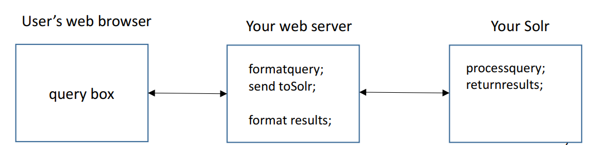
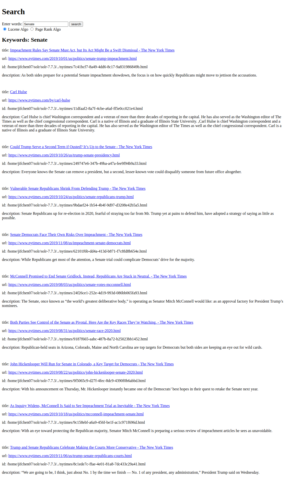
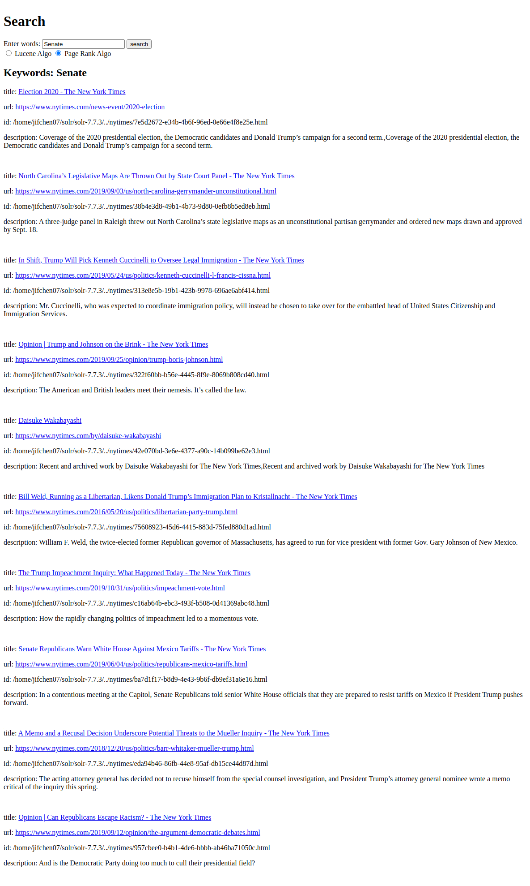

## Project Description

In this project, the Apache Solr software is used to import and index a set of web pages crawled from NYTIMES. Then NodeJS is used to build a web server that supports simple querying functionalities within the NYTIMES domain based on the Solr server.

## Steps to complete the project

### Indexing using Solr

1. Download [Solr](https://solr.apache.org/downloads.html)

   Solr version 7.7.3 is used.

2. Create new core

   ````
   bin/solr start
   bin/solr create -c <core_name>
   ````

   new core now is created in `solr-7.3.3/server/solr/<core_name>`, file structure:

   ```
   ├── conf
   │   ├── lang
   │   ├── managed-schema
   │   ├── params.json
   │   ├── protwords.txt
   │   ├── solrconfig.xml
   │   ├── stopwords.txt
   │   └── synonyms.txt
   ├── core.properties
   └── data
       ├── external_pageRankFile.txt
       ├── index
       ├── snapshot_metadata
       └── tlog
   
   ```

3. Index HTML files using Solr

   Solr inherently uses Tika (uses TagSoup library) for extracting content from the documents that will be indexed.

   We have to edit the `managed-schema` file to make sure that all the text content from the html pages extracted by Tika are mapped correctly.  Uncomment the following code block in `managed-schema`:

   ```
   <copyField source="*" dest="_text_"/>
   ```

   What is done here is combining all the information from different fields into a single field: `"_text_"`

   Then use the following command to perform indexing on the crawl data:

   ```
   bin/post –c <core_name> -filetypes html <path_to_crawl_folder>
   ```

4. Verify Solr is working in the Solr UI: http://localhost:8983/solr/

5. Modify `solrconfig.xml` to Configure Solr to default query from field `"_text_"`

   ```
   <requestHandler name="/select" class="solr.SearchHandler">
       <!-- default values for query parameters can be specified, these
            will be overridden by parameters in the request
         -->
       <lst name="defaults">
         <str name="echoParams">explicit</str>
         <int name="rows">10</int>
         <str name="df">_text_</str>
         ...
   ```

6. Reload the core and query with new configuration.

7. Now API calls can be performed on Solr server. For example: 

   ```
   http://localhost:8983/solr/myexample/select?q=California
   ```

   returns the query results of keyword "California" in JSON format


### Implement Web Server in Node.js



Next, a web server is implemented in Node.js (with express as the app framework) to deliver a web page with simple search box (implemented as form). The web server processes and formats the query from user, and makes API request to Solr server.  The Solr server will process the request and return results in JSON format to the web server. The web server then re-formats the results and presents them on the web page.  EJS is used to generate the frontend HTML web page. 


### Implement PageRank Algorithm

What is PageRank and why some pages have higher PageRank values than others? 

> * PageRank is a web link analysis algorithm used by Google.
> * PageRank is a “vote”, by all the other pages on the Web, about how important a page is.  
> * A link to a page counts as a vote of support.  
> * PageRank says nothing about the content or size of a page, the language it’s written in, or the text used in the anchor of a link.
> * Looked at another way, PageRank is a probability distribution used to represent the likelihood that a person randomly clicking on links will arrive at any particular page  

So if a page has more links pointing to it and/or the pages pointing to it have relatively high PageRank, it will have a higher PageRank score.

Solr uses Lucene to facilitate ranking. Lucene uses a combination of the Vector Space Model and the Boolean Model to determine how relevant a given document is to a user's query. The vector space model is based on term frequency. The Boolean model is first used to narrow down the documents that need to be scored based on the use of Boolean logic in the query specification.  

Solr permits us to change the ranking algorithm.  So as an experiment, PageRank algorithm is also implemented to see how its results differ from those of the default algorithm. There are several ways to manipulate the ranking of a document in Solr. Here, we apply the method which uses a field that refers to an external file that stores the PageRank scores. The key is to create that external file of PageRank scores.

Python with several libraries are used to generate the `external_pageRankFile.txt`  file:

* BeautifulSoup4

  Used to parse html web pages and extract outgoing links.

* NetworkX  

  Used to generate a directional graph of the web pages and the PageRank scores of each node (web page file)

The python script `extract_links.py` contains all the code to parse html pages files, generate the graph and generate the `external_pageRankFile.txt`.

The file is then placed in `solr-7.3.3/server/solr/<core_name>/data/`.

Then in `managed-schema` file, the following `fieldType` and `field` are added:

```
<!-- added for page rank file -->
<fieldType name="external" keyField="id" defVal="0" class="solr.ExternalFileField"/>
<field name="pageRankFile" type="external" stored="false" indexed="false"/>
```

In `solrconfig.xml` file, the `eventListener`s are updated to load the external file when either a searcher is loaded or when a new searcher is started:

    <listener event="newSearcher" class="org.apache.solr.schema.ExternalFileFieldReloader">
      <arr name="queries"></arr>
    </listener>
    <listener event="firstSearcher" class="org.apache.solr.schema.ExternalFileFieldReloader">
      <arr name="queries"></arr>
    </listener>

Now we can apply searches using PageRank algorithm by setting the "`sort`" parameter to "`pageRankFile desc`".


### Example Flow of a Query

1. Initial search box:

   

2. Search results using Lucene(default) algorithm:

   

3. Search results using PageRank algorithm:

   

4. An actual page that opens when clicking on one of the result links:

   
